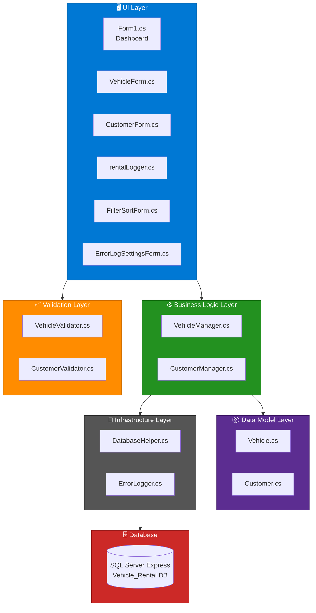
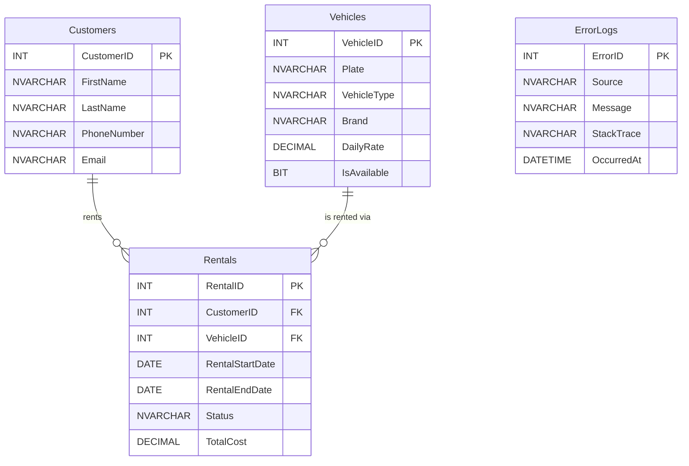
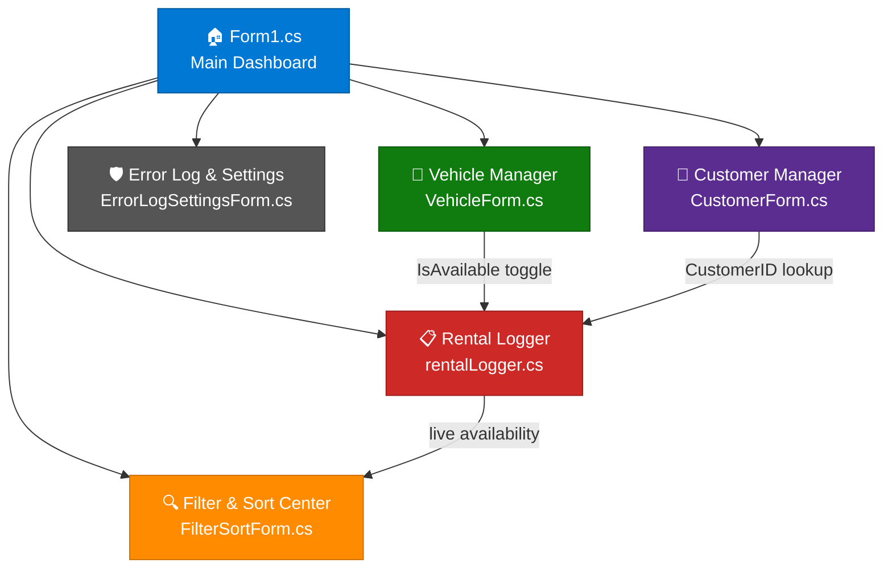

<div align="center">

# 🚗 Vehicle Rental System

[](https://dotnet.microsoft.com/)
[](https://learn.microsoft.com/en-us/dotnet/desktop/winforms/)
[](https://www.microsoft.com/en-us/sql-server/)
[](https://visualstudio.microsoft.com/)

**A complete desktop application for managing a vehicle rental business — customers, fleet, bookings, and more.**

[Overview](#-project-overview) • [Architecture](#-architecture) • [Database](#-database-schema) • [Modules](#-application-modules) • [Setup](#-installation--setup)

</div>

---

## 🚀 Project Overview

The **Vehicle Rental System** is a desktop application built with **C# Windows Forms** and a **SQL Server Express** backend. It provides a complete workflow for managing a vehicle rental business — from registering customers and vehicles through to logging active rentals and tracking returns.

The application follows a clean separation of concerns: data models, business logic, validation, and UI are each handled by dedicated classes and forms, making the codebase maintainable and extendable.

---

## 📊 Architecture

### Application Layers



### Project Structure

| Layer | Files | Responsibility |
|---|---|---|
| **UI Layer** | `VehicleForm`, `CustomerForm`, `rentalLogger`, etc. | Windows Forms views — each extends `BaseForm` |
| **Base / Theme** | `BaseForm.cs` | Shared theme, fixed window size, auto-logo injection |
| **Business Logic** | `VehicleManager.cs`, `CustomerManager.cs` | All CRUD operations against the database |
| **Validation** | `VehicleValidator.cs`, `CustomerValidator.cs` | Input validation rules — independent of UI |
| **Data Models** | `Vehicle.cs`, `Customer.cs` | Plain entity classes with computed properties |
| **Database** | `DatabaseHelper.cs` | Single connection factory for SQL Server |
| **Error Handling** | `ErrorLogger.cs` | System-wide exception logger (DB + in-memory fallback) |

### Technology Stack

| Technology | Version | Role |
|---|---|---|
| **C#** | .NET 4.7.2 | Core application language |
| **Windows Forms** | WinForms | Desktop UI framework |
| **SQL Server Express** | 2022 | Relational database backend |
| **Visual Studio** | 2022 | IDE and build tooling |

---

## 🗄️ Database Schema

The `Vehicle_Rental` database contains four tables:

### Tables Overview



### Customers

| Column | Type | Constraint | Description |
|---|---|---|---|
| `CustomerID` | INT | PK, Identity | Auto-incremented primary key |
| `FirstName` | NVARCHAR(50) | NOT NULL | 2–50 chars, letters only |
| `LastName` | NVARCHAR(50) | NOT NULL | 2–50 chars, letters only |
| `PhoneNumber` | NVARCHAR(20) | — | 10–15 digit phone number |
| `Email` | NVARCHAR(100) | — | Valid email address (max 100 chars) |

### Vehicles

| Column | Type | Constraint | Description |
|---|---|---|---|
| `VehicleID` | INT | PK, Identity | Auto-incremented primary key |
| `Plate` | NVARCHAR(20) | UNIQUE, NOT NULL | License plate (alphanumeric) |
| `VehicleType` | NVARCHAR(50) | — | Type label (e.g. Sedan, SUV) |
| `Brand` | NVARCHAR(50) | — | Manufacturer brand name |
| `DailyRate` | DECIMAL(10,2) | NOT NULL | Daily rental rate |
| `IsAvailable` | BIT | DEFAULT 1 | `1` = available; `0` = rented out |

### Rentals

| Column | Type | Constraint | Description |
|---|---|---|---|
| `RentalID` | INT | PK, Identity | Auto-incremented primary key |
| `CustomerID` | INT | FK → Customers | Links to the renting customer |
| `VehicleID` | INT | FK → Vehicles | Links to the rented vehicle |
| `RentalStartDate` | DATE | NOT NULL | Date rental begins |
| `RentalEndDate` | DATE | NOT NULL | Must be strictly after start date |
| `Status` | NVARCHAR(20) | — | `'Active'` on creation; `'Returned'` on return |
| `TotalCost` | DECIMAL(10,2) | — | Calculated rental cost |

### ErrorLogs

| Column | Type | Constraint | Description |
|---|---|---|---|
| `ErrorID` | INT | PK, Identity | Auto-incremented primary key |
| `Source` | NVARCHAR(200) | — | Code location where exception was caught |
| `Message` | NVARCHAR(MAX) | — | Exception message text |
| `StackTrace` | NVARCHAR(MAX) | — | Full .NET stack trace |
| `OccurredAt` | DATETIME | — | Timestamp of the error |

---

## 📦 Application Modules

### Module Navigation Flow



### 🏠 Main Dashboard — `Form1.cs`

The entry point of the application. On load it verifies the database connection and displays a warning if it is unreachable. Six navigation buttons open every module of the system as modal or modeless dialogs.

### 🚗 Vehicle Manager — `VehicleForm.cs`

Full CRUD management of the vehicle fleet. Vehicles are displayed in a **colour-coded DataGridView** — green rows are available, red rows are rented out. Selecting a row populates the input fields for editing.

| Action | Behaviour |
|---|---|
| **+ Add** | Validates via `VehicleValidator`, inserts record, refreshes grid |
| **Update** | Validates then updates selected vehicle in the database |
| **Delete** | Confirms via dialog, then hard-deletes the selected vehicle |
| **Clear Fields** | Resets all input fields and availability checkbox |

### 👤 Customer Manager — `CustomerForm.cs`

Full CRUD management of the customer register. The `CustomerValidator` enforces all field rules before any write reaches the database. Errors are collected using a **ValidationResult pattern** — all failures are displayed at once rather than stopping at the first one.

| Field | Validation Rule |
|---|---|
| First Name | Required, 2–50 characters, letters/spaces/hyphens only |
| Last Name | Required, 2–50 characters, letters/spaces/hyphens only |
| Phone Number | Required, 10–15 digits (spaces, dashes, + allowed) |
| Email | Required, standard email format, max 100 characters |

### 📋 Rental Logger — `rentalLogger.cs`

Records and manages rental transactions. The grid shows each rental joined with the customer name and vehicle plate/brand for easy reading.

| Action | Behaviour |
|---|---|
| **Add Rental** | Validates CustomerID/VehicleID exist; validates dates; inserts rental with `Status='Active'`; sets `IsAvailable=0` |
| **Mark as Returned** | Sets `Status='Returned'`; sets `IsAvailable=1` — vehicle immediately re-appears as available |
| **Refresh** | Reloads the rental list from the database |

> **Date rules:** return date must be strictly *after* the start date. Same-day and reverse-date bookings are both rejected with a descriptive warning.

### 🔍 Filter & Sort Center — `FilterSortForm.cs`

A unified search and filter tool for all three main data sets. Results update on each **Apply** click.

| Table | Filter Options | Search / Sort |
|---|---|---|
| Vehicles | All / Available / Not Available | Text search on Brand and Type; Bubble Sort A-Z / Z-A |
| Customers | All | Text search on First/Last Name; Bubble Sort A-Z / Z-A |
| Rentals | All / Active / Returned | DataView row filter on Status column |

A dedicated **Show Available** button instantly loads only available vehicles without requiring dropdown configuration.

### 🛡️ Error Log & Settings — `ErrorLogSettingsForm.cs`

A two-tab utility form for visibility into system health and DB configuration:

- **Error Log tab** — all `ErrorLogs` records, sorted most-recent-first. Stack traces shown on demand via popup.
- **Settings tab** — current connection string with a live **Test Connection** button.
- **In-memory fallback** — if the database is unreachable, errors are stored in memory and rendered instead.

---

## ✨ Features

**🖥️ Clean Desktop UI:** Consistent shared theme, fixed window sizing, and auto-injected logo across all forms via `BaseForm` inheritance.

**🔄 Full CRUD Operations:** Add, update, delete, and view records for vehicles, customers, and rentals — with real-time DataGridView refresh after every write.

**🎨 Colour-Coded Fleet View:** Available vehicles show in green, rented vehicles in red — instantly visible without any filtering.

**✅ Layered Validation:** `VehicleValidator` (fail-fast) and `CustomerValidator` (collect-all) enforce business rules independently of the UI.

**🔗 Automatic Availability Management:** Adding a rental sets the vehicle unavailable; marking it returned flips it back — no manual steps, no stale data.

**🔍 Unified Filter & Sort Center:** Search, filter, and sort across all three entities in one place, with a one-click Show Available shortcut.

**🛡️ Resilient Error Handling:** Every user action is wrapped in try/catch. Errors are logged to the DB (or held in memory if the DB is down) and surfaced as friendly messages — never raw stack traces.

**🔌 Connection Monitoring:** Dashboard checks DB connectivity on startup; Settings tab allows live testing at any time.

---

## ⚡ Design Decisions

### Separation of Concerns
Business logic lives entirely in `*Manager.cs` classes. Forms contain zero SQL and zero validation logic — they only call managers and validators, then render results.

### Dual Error Storage
`ErrorLogger` writes to `ErrorLogs` first, but falls back silently to a static in-memory list if the database is unavailable, so the application never crashes due to a logging failure.

### Validation Strategies
`VehicleValidator` throws on the first failure (fast feedback for simple fields), while `CustomerValidator` collects all errors before showing them (better UX for multi-field forms). Both strategies are intentional.

### Rental Date Enforcement
Same-day and reverse-date bookings are rejected at the business logic layer, not just the UI — ensuring rules are enforced regardless of how data enters the system.

---

## 🗂️ File Reference

| File | Type | Purpose |
|---|---|---|
| `Form1.cs` | UI Form | Main dashboard — navigation hub |
| `VehicleForm.cs` | UI Form | Vehicle CRUD — Add, Update, Delete |
| `CustomerForm.cs` | UI Form | Customer CRUD — Add, Update, Delete |
| `rentalLogger.cs` | UI Form | Rental management — Add, Return, Refresh |
| `FilterSortForm.cs` | UI Form | Search, filter, and sort across all entities |
| `ErrorLogSettingsForm.cs` | UI Form | Error log viewer and connection string settings |
| `BaseForm.cs` | Base Class | Shared theme, size, and logo for all forms |
| `VehicleManager.cs` | Logic | Vehicle CRUD + availability toggle |
| `CustomerManager.cs` | Logic | Customer CRUD operations |
| `Vehicle.cs` | Model | Vehicle entity with `AvailabilityStatus` property |
| `Customer.cs` | Model | Customer entity with `FullName` property |
| `VehicleValidator.cs` | Validation | Plate, type, brand, daily rate rules |
| `CustomerValidator.cs` | Validation | Name, phone, email rules — collects all errors |
| `DatabaseHelper.cs` | Utility | SQL Server connection factory |
| `ErrorLogger.cs` | Utility | System-wide exception logger (DB + memory) |
| `Program.cs` | Entry Point | Application entry — launches `Form1` |

---

## 🛠️ Installation & Setup

### Prerequisites

- Visual Studio 2022 (or later)
- .NET Framework 4.7.2
- SQL Server Express (any recent version)
- SQL Server Management Studio (SSMS) or any SQL client

### 1. Clone the Repository

```bash
git clone https://github.com/your-username/VehicleRentalSystem.git
cd VehicleRentalSystem
```

### 2. Database Setup

Open SSMS and run the following SQL to create the database and all tables:

```sql
CREATE DATABASE Vehicle_Rental;
GO
USE Vehicle_Rental;
GO

CREATE TABLE Customers (
    CustomerID  INT PRIMARY KEY IDENTITY(1,1),
    FirstName   NVARCHAR(50)  NOT NULL,
    LastName    NVARCHAR(50)  NOT NULL,
    PhoneNumber NVARCHAR(20),
    Email       NVARCHAR(100)
);

CREATE TABLE Vehicles (
    VehicleID   INT PRIMARY KEY IDENTITY(1,1),
    Plate       NVARCHAR(20)   UNIQUE NOT NULL,
    VehicleType NVARCHAR(50),
    Brand       NVARCHAR(50),
    DailyRate   DECIMAL(10,2)  NOT NULL,
    IsAvailable BIT            DEFAULT 1
);

CREATE TABLE Rentals (
    RentalID        INT PRIMARY KEY IDENTITY(1,1),
    CustomerID      INT  NOT NULL,
    VehicleID       INT  NOT NULL,
    RentalStartDate DATE NOT NULL,
    RentalEndDate   DATE NOT NULL,
    Status          NVARCHAR(20),
    TotalCost       DECIMAL(10,2),
    CONSTRAINT FK_Rental_Customer FOREIGN KEY (CustomerID) REFERENCES Customers(CustomerID),
    CONSTRAINT FK_Rental_Vehicle  FOREIGN KEY (VehicleID)  REFERENCES Vehicles(VehicleID)
);

CREATE TABLE ErrorLogs (
    ErrorID    INT IDENTITY PRIMARY KEY,
    Source     NVARCHAR(200),
    Message    NVARCHAR(MAX),
    StackTrace NVARCHAR(MAX),
    OccurredAt DATETIME
);
```

### 3. Configure Connection String

Open `DatabaseHelper.cs` and update the connection string to match your SQL Server instance:

```csharp
private static readonly string connectionString =
    @"Server=YOUR_SERVER_NAME\SQLEXPRESS;Database=Vehicle_Rental;Integrated Security=True;";
```

### 4. Build & Run

```
1. Open VehicleRentalSystem.sln in Visual Studio
2. Build → Build Solution  (Ctrl+Shift+B)
3. Debug → Start Debugging  (F5)
```

The application verifies the database connection on startup and warns you if it is unreachable.

---

## 🔧 Troubleshooting

<details>
<summary><strong>🔴 "Cannot connect to database" on startup</strong></summary>

**Symptoms**: Warning dialog appears immediately when the app launches.

**Likely causes:**
- SQL Server Express service is not running
- Connection string server name is incorrect
- Windows authentication is not configured

**Solution:**
```
1. Open Services (services.msc) → ensure "SQL Server (SQLEXPRESS)" is Running
2. Verify the server name in DatabaseHelper.cs matches your instance
3. Try connecting in SSMS with the same credentials first
```
</details>

<details>
<summary><strong>🟡 Vehicle not showing as available after return</strong></summary>

**Symptoms**: Vehicle remains red (unavailable) in Vehicle Manager after marking a rental as Returned.

**Solution**: Click **Refresh** in Vehicle Manager to reload the grid. Availability is updated immediately in the DB but the grid requires a manual refresh.
</details>

<details>
<summary><strong>🔴 Build errors referencing missing namespace</strong></summary>

**Symptoms**: Compilation fails with `CS0246` type-not-found errors.

**Solution**: Ensure the project targets **.NET Framework 4.7.2** under Project Properties → Application → Target Framework.
</details>

---

## 👥 Project Team

| Member Name |
|---|
| Ziad Ahmed Elbahy |
| Abdelrahman Sapry Abdelaziz |
| Zyad Akram Mahgoub |
| Seif Eldeen Mohamed |
| Mohamed Ehab |
| Mohamed Ahmed Said |
